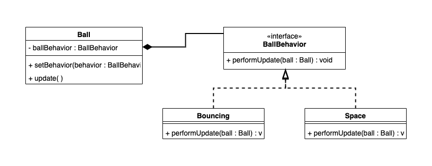

# PRG08-basketball-strategy

[Demo Bastketball Strategy](https://hr-cmgt.github.io/PRG08-basketball-strategy-completed/)

In deze opdracht is het de bedoeling om het strategy pattern toe te passen. Op dit moment hebben de verschillende type ballen hun eigen gedrag in de class. 

Uiteindelijk is er maar 1 Ball class en de manier waarom de ball beweegt (wel of niet stuitert) zal opgenomen worden in behavior classes. 

## Opdracht 1
Laat de basketball bewegen door het scherm zodat 'op aarde' de bal stuitert en 'op de maan' de bal tegen de randen van het scherm bots zonder zwaartekracht. 

## Opdracht 2 
Voeg het strategy pattern toe zodat hetzelfde effect als bij opdracht 1 bereikt wordt. Als de basketball over de middellijn is, wordt vanuit de main het gedrag veranderd. 

